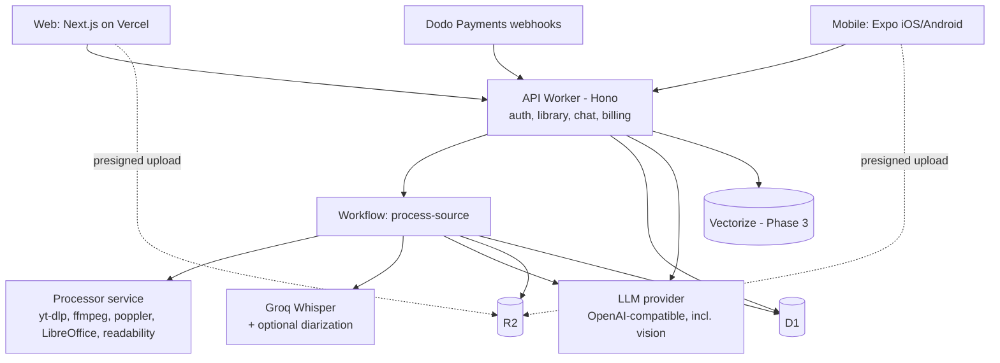

# anything2note.com — Full Build Plan

Upload **anything** — a YouTube link, an audio recording of a class, a lecture video, a podcast, a PDF, slides, a photo of a whiteboard, a web article, or pasted text — pick what kind of content it is, and get highly detailed notes plus the right extras for that type: detailed notes, flashcards, quizzes, and tasks & deadlines for lectures a student records in class; and so on. Every item also gets an AI assistant you can chat with about it. Available on web, iOS, and Android.

---

## 1. Decisions

| Area | Choice | Notes |
|---|---|---|
| Web frontend | Next.js (App Router) on Vercel | Tailwind + shadcn/ui |
| Mobile | Expo (React Native) | Expo Router, EAS Build/Submit/Update |
| Backend API | Cloudflare Workers + Hono | `api.anything2note.com` |
| Pipeline orchestration | Cloudflare Workflows (+ Queues) | Durable steps with per-step retries |
| Database | Cloudflare D1 (SQLite) | Drizzle ORM (`drizzle-orm/d1`); large extracted content stored in R2 |
| File storage | Cloudflare R2 | Uploads, recordings, audio chunks, extracted content, exports |
| Vector search | Cloudflare Vectorize | Phase 3, for chat across many items; D1 FTS5 for keyword search |
| Processor service | Node 22 + Hono wrapping yt-dlp, ffmpeg, poppler, LibreOffice | Portable Docker image: Cloudflare Containers **or** Fly.io/Railway |
| LLM | Any OpenAI-compatible provider (e.g. OpenRouter) | Model configurable per task (notes, light, chat, vision, fallback) |
| Transcription | Groq Whisper (OpenAI-compatible) | Captions first for YouTube; Whisper for everything else |
| Speaker labels (diarization) | Optional pluggable provider (e.g. AssemblyAI or Deepgram) | Used for interviews/podcasts when configured |
| Auth | Better Auth on Workers + D1 | Web cookies + Expo plugin |
| Payments | Dodo Payments (merchant of record) for everyone | Subscriptions with a 7-day card-required trial + one-time credit top-ups; see §8 |
| Mobile payments | None in-app for now; subscribe on the web | RevenueCat (App Store + Play IAP) later if store review requires it; see §8 |
| Email | Resend (prod), console logging (local) | OTP codes, "notes ready", share links |
| Monitoring | Sentry, PostHog, Workers Logs | |
| Monorepo | pnpm workspaces + Turborepo | Shared TypeScript everywhere |

---

## 2. Product scope (full version)

### 2.1 Sources (what users can give us)

| Source | Formats | How content is extracted |
|---|---|---|
| YouTube link | Any public video | Captions first (manual → auto); else audio download → Whisper |
| Audio upload | mp3, m4a, wav, ogg, opus, flac, aac, webm | ffmpeg normalise → chunk → Whisper (+ diarization for interviews/podcasts) |
| Video upload | mp4, mov, mkv, webm, avi | ffmpeg extracts audio → same as audio |
| In-app recording | Web (MediaRecorder) and mobile (expo-audio, background-capable) | Same as audio |
| PDF | Text PDFs and scanned PDFs | Text layer via poppler; pages with little/no text rendered to images → vision model OCR |
| Office documents | docx, pptx, odt, odp, rtf | LibreOffice headless → PDF → same as PDF (keeps page/slide numbers) |
| Images | jpg, png, webp, heic (whiteboards, handwritten notes, slide photos) | Vision model OCR + description |
| Plain text | txt, md, pasted text | Used directly |
| Web page / article | Public URL | Fetch + readability extraction (paywalled/login pages won't work) |

Every source is normalised into one internal format so all generators work the same way:

```ts
type ExtractedContent = {
  kind: 'timed' | 'paged' | 'plain'           // media | documents/images | text
  language: string
  segments: Array<{
    anchor: { type: 'time'; start: number; end: number } | { type: 'page'; page: number } | { type: 'none' }
    speaker?: string                            // 'S1', 'S2' … when diarization is available
    text: string
  }>
  sections: Array<{ title: string; anchorStart: Anchor; anchorEnd: Anchor }>
}
```

### 2.2 Note types (what users choose) and their outputs

Users pick a note type when adding a source, or choose **Auto-detect** (a cheap model classifies the first part of the content and suggests a type; the user can change it). Each type is a **preset** of output types; users can add or remove any output before or after generation ("also make a practice exam for this lecture").

| Note type | Default outputs | Optional outputs |
|---|---|---|
| **Lecture / class** (YouTube lectures, slides, and audio a student records in class) | Detailed notes, revision bullet points, flashcards, quiz, glossary, tasks & deadlines | TL;DR summary, key formulas, practice exam questions, mind map outline |
| **Interview** | Summary, Q&A breakdown, key insights, highlights (speaker + timestamp) | Follow-up questions, evaluation scorecard (hiring), detailed notes |
| **Podcast / talk / webinar** | Summary, key takeaways, chapters, detailed notes | Highlights, action ideas, flashcards |
| **Tutorial / how-to** | Step-by-step guide, prerequisites, commands/code snippets, summary | Troubleshooting tips, checklist, quiz |
| **Reading (paper, article, book chapter, document)** | Summary, detailed notes, key concepts, flashcards, quiz | Glossary, critique / limitations, citations list |
| **General** | Summary, detailed notes, key points | Any output above |

**Tasks & deadlines** structure: everything the lecturer assigns or announces in class — homework, readings, project/lab work, and exam dates — each with a kind (`homework | reading | project | exam`), a due date only if one was said (otherwise "Not mentioned"), and an anchor to the moment it was said.

**All note types also get:**
- AI chat about the item (streaming, cites timestamps or page numbers).
- Custom instructions ("focus on the worked examples", "write for a first-year student").
- Output language choice (notes in a different language from the source).
- Anchors on everything: timestamps for media (click to seek the player) and page/slide numbers for documents (click to jump in the viewer).
- Regenerate any single output; edit outputs manually.

### 2.3 Per-user features

- Library of items with folders/workspaces, search, filters by note type and source.
- Spaced-repetition flashcard reviews (FSRS) across all items that have flashcards.
- Quiz attempts, scores, weak topics.
- **Tasks tracker** across all lectures (mark done, edit kind/due date, group by lecture or due date).
- Speaker renaming for lectures/interviews ("S1 → Dr. Rao").
- Exports: PDF, Markdown, DOCX, Anki CSV (and `.apkg` in Phase 3); share read-only link.
- Daily review reminders (push on mobile, email on web); "notes ready" notifications.
- Retention settings: auto-delete original recordings/files after processing (default on for class recordings).

---

## 3. Architecture



### Key principles

1. **Public vs private sources.** Public YouTube videos are **shared**: processed once and reused by every user who adds the same video (same note type + output + language), at zero extra cost. Everything else (uploads, recordings, URLs, pasted text) is **private** to its owner and is never reused across users — class recordings and documents are private. Private items are deduplicated only within the same user (by content hash).
2. **Captions first** for YouTube; Whisper only when needed.
3. **One extraction format, many generators.** Every source becomes `ExtractedContent`; every output type is a generator that reads it. Note types are just presets of output types, so adding a new note type is configuration, not new pipeline code.
4. **Provider-agnostic AI.** All LLM, vision, transcription, diarization, and embedding calls go through small clients configured by base URL, key, and model.
5. **Shared content vs user state.** Sources and generations may be shared (public YouTube only); libraries, reviews, quiz attempts, task status, speaker names, and chats are per user.
6. **Processor never holds R2 credentials.** The Worker streams files from R2 to the processor and streams results back into R2.

---

## 4. Monorepo layout

```
anything2note/
  apps/
    api/          Hono Worker: routes, Workflows, queue consumers, cron, webhooks
    web/          Next.js app
    mobile/       Expo app
    processor/    Node + Hono service wrapping yt-dlp, ffmpeg, poppler, LibreOffice
  packages/
    config/       env validation helper (defineConfig) + schema fragments
    shared/       zod schemas for API I/O, domain types, note types/outputs registry, plan limits
    api-client/   typed client used by web + mobile
    ai/           OpenAI-compatible clients, generators (one per output type), prompts, mock fixtures
    ui-tokens/    colours/spacing/typography shared by web + mobile
  docker/         Dockerfiles for local dev
  docker-compose.yml
  plan.md
  CLAUDE.md
```

---

## 5. Backend (Cloudflare)

### 5.1 API Worker routes (Hono)

| Method | Route | Purpose |
|---|---|---|
| * | `/auth/*` | Better Auth handler |
| GET | `/note-types` | Registry of note types and output types (clients render pickers from this) |
| POST | `/uploads` | Start an upload: returns presigned R2 URL(s) (multipart for large files) |
| POST | `/uploads/:id/complete` | Finish multipart upload, verify size/type |
| POST | `/sources` | Create an item: `{ source: youtube \| upload \| url \| text, noteType \| 'auto', outputs?, language?, instructions? }` → starts Workflow (or reuses shared result) |
| GET | `/sources/:id` | Status, metadata, note type, available outputs |
| PATCH | `/sources/:id` | Change title, folder, note type (triggers generation of missing outputs) |
| DELETE | `/sources/:id` | Remove from library (and delete private data) |
| GET | `/sources/:id/content` | Extracted transcript/text with anchors |
| GET | `/sources/:id/outputs` | All generated outputs for this item |
| POST | `/sources/:id/outputs` | Generate an extra output type |
| POST | `/generations/:id/regenerate` | Regenerate one output (optionally with new instructions) |
| PATCH | `/generations/:id` | Save manual edits (stored as a per-user override) |
| PATCH | `/sources/:id/speakers` | Rename speakers |
| GET | `/sources/:id/media` | Short-lived signed URL for the user's own uploaded media/document viewer |
| POST | `/sources/:id/chat` | Streaming chat (SSE) |
| GET | `/sources/:id/chat` | Chat history |
| GET | `/library` | Items, folders, filters |
| GET/PATCH | `/tasks` | List/update tasks & deadlines across lectures |
| GET | `/reviews/due` | Flashcards due today (FSRS) |
| POST | `/reviews` | Submit card rating |
| POST | `/quiz/:generationId/attempts` | Submit quiz answers |
| GET | `/stats` | Streaks, weak topics, credit usage |
| POST | `/exports` | Create PDF/Markdown/DOCX/Anki export |
| POST | `/shares` | Create a read-only share link |
| POST | `/billing/checkout` | Create a Dodo subscription checkout (`{ plan, interval }`, 7-day trial applied) |
| POST | `/billing/topup` | Create a Dodo one-time checkout for a credit pack (active plan required) |
| POST | `/billing/change-plan` | Upgrade (immediate, prorated) or downgrade (at next renewal) |
| GET | `/billing/portal` | Link to Dodo's customer portal (card, invoices, cancel) |
| GET | `/billing/credits` | Credit balance, buckets and ledger history |
| POST | `/webhooks/dodo` | Subscription and payment events |
| GET | `/me` | Profile, plan, subscription status, credit balance |

Middleware: CORS, auth session, rate limiting, zod validation, Sentry.

### 5.2 Processing pipeline (Cloudflare Workflow: `process-source`)

1. **Validate & hold credits** — file type/size and max length against the plan; estimate credits from duration (media) or page count (documents) and place a credit hold (§8 Credits). No active plan or not enough credits → stop before any AI spend.
2. **Extract** (branch by source):
   - YouTube → captions via processor; else processor downloads audio → chunks → R2.
   - Audio/video/recording → Worker streams file from R2 to processor → normalised, chunked audio → R2.
   - PDF/Office → processor extracts per-page text; low-text pages rendered to PNG → vision model OCR.
   - Image → vision model OCR/description.
   - URL → processor fetches + readability; Text → used directly.
3. **Transcribe** (media only) — Groq Whisper per chunk with segment timestamps; if note type is interview/podcast and a diarization provider is configured, use it for speaker labels.
4. **Normalise** — build `ExtractedContent`, clean text, merge fragments, split into sections; store in R2 (`content/{sourceId}.json`).
5. **Classify** (only if note type = auto) — light model suggests the note type; user can change it later.
6. **Generate primary output** first (notes for lectures, summary for others) so the user sees something quickly.
7. **Generate remaining outputs** in parallel, respecting dependencies (e.g. flashcards and quiz read the detailed notes).
8. **Validate** every output with zod; repair-retry on failure; fallback model on provider errors.
9. **Save + settle + notify** — write generations, tasks, flashcards, quiz questions; settle the credit hold at the actual minutes/pages (release it entirely if the item failed); mark `ready`; push/email.
10. **Cleanup** — delete audio chunks; delete original uploads if the user's retention setting says so.

Status values: `queued → extracting → transcribing → generating → ready | failed` (partial success allowed: an output can fail and be retried without failing the item).

### 5.3 Processor service (`apps/processor`)

- Node 22 + Hono, shelling out to `yt-dlp`, `ffmpeg`, `pdftotext`/`pdftoppm` (poppler), and LibreOffice headless; `@mozilla/readability` + `linkedom` for web pages.
- Endpoints:
  - `GET /health`
  - `POST /youtube/metadata`, `POST /youtube/captions`
  - `POST /media` (body: file stream from the Worker, or `{ youtubeId }`) → normalises, compresses (mono, low bitrate), chunks; returns manifest `{ jobId, durationSeconds, chunks: [{ index, durationSeconds, bytes }] }`
  - `GET /media/:jobId/:index` → streams a chunk with `Content-Length`
  - `POST /document` (body: file stream + filename) → `{ jobId, pages: [{ page, text, needsOcr }] }`
  - `GET /document/:jobId/pages/:page.png` → rendered page image for OCR
  - `POST /url` → `{ title, text, byline?, siteName? }`
  - `DELETE /jobs/:jobId` → cleanup (also automatic after `FILE_TTL_MINUTES`)
- Auth: shared secret header (`FETCHER_MODE=http`) or Cloudflare Containers binding (`FETCHER_MODE=container`).
- yt-dlp updated weekly in the image; supports cookies file and proxy via env.
- Deploy: start on Cloudflare Containers; move to Fly.io/Railway if YouTube blocks heavily. Same image.

### 5.4 AI layer (`packages/ai`)

**Registry (`packages/shared/note-types.ts`)** — note types and output types are data:

```ts
export const OUTPUT_TYPES = {
  detailed_notes:   { tier: 'notes', schema: DetailedNotes },
  revision_points:  { tier: 'light', schema: RevisionPoints, dependsOn: ['detailed_notes'] },
  flashcards:       { tier: 'light', schema: Flashcards,     dependsOn: ['detailed_notes'] },
  quiz:             { tier: 'light', schema: Quiz,           dependsOn: ['detailed_notes'] },
  glossary:         { tier: 'light', schema: Glossary },
  tasks:            { tier: 'light', schema: Tasks },
  summary:          { tier: 'light', schema: Summary },
  chapters:         { tier: 'light', schema: Chapters },
  qa_breakdown:     { tier: 'notes', schema: QABreakdown },
  step_by_step:     { tier: 'notes', schema: StepGuide },
  // … every output listed in §2.2
} as const

export const NOTE_TYPES = {
  lecture: { label: 'Lecture / class', defaults: ['detailed_notes','revision_points','flashcards','quiz','glossary','tasks'], optional: [...] },
  // interview, podcast, tutorial, reading, general
} as const
```

Each output type has a generator in `packages/ai/generators/<type>.ts`: prompt builder (note-type-aware tone and structure), zod schema, model tier, and a mock fixture. The same generator adapts to the note type (e.g. `detailed_notes` for a lecture is organised by concept; for a tutorial by step).

**Config (per task, via env/secrets)**

```
LLM_BASE_URL=https://openrouter.ai/api/v1
LLM_API_KEY=...
MODEL_NOTES=...        # long-form: detailed notes, Q&A, guides
MODEL_NOTES_PRO=...    # stronger long-form model for Pro subscribers (§8)
MODEL_LIGHT=...        # structured/short: cards, quiz, tasks, summaries, classification
MODEL_CHAT=...         # tutor/assistant chat
MODEL_VISION=...       # OCR for images and scanned pages
MODEL_FALLBACK=...     # used if primary errors
STT_BASE_URL=https://api.groq.com/openai/v1
STT_API_KEY=...
STT_MODEL=whisper-large-v3-turbo
DIARIZATION_PROVIDER=none   # none | assemblyai | deepgram
DIARIZATION_API_KEY=...
EMBEDDING_MODEL=...    # Phase 3, for Vectorize (dimensions must match the index)
```

**Rules**
- All generation returns JSON validated by zod schemas in `packages/shared`.
- Every note section, flashcard, quiz question, and task carries an **anchor** (timestamp or page).
- Store `prompt_version` and `model` on each generation so old outputs can be regenerated when prompts improve.
- Long content uses map-reduce: per-section generation, then a merge/dedupe pass.
- Speaker names: use diarization labels; the LLM may *suggest* names from self-introductions, marked as suggestions until the user confirms.
- Custom instructions make a generation private to that user even for shared YouTube sources.

**Chat**
- Context = system prompt (note-type aware: tutor for lectures, research assistant for readings) + extracted content with anchors + key outputs + recent messages.
- Most items fit in context; for very long documents, retrieve relevant sections first (keyword search in Phase 1–2, Vectorize in Phase 3).
- Prompt caching where the provider supports it; stream over SSE; save messages to D1.
- Phase 3: chat across a folder/workspace ("what did the lecturer say about SN1 across all my chemistry lectures?") using Vectorize + FTS5.

---

## 6. Database (Cloudflare D1 + Drizzle)

### Setup

- Separate D1 databases per environment: `a2n-dev`, `a2n-staging`, `a2n-prod`.
- Drizzle ORM with `drizzle-orm/d1`; migrations via `drizzle-kit generate`, applied with `wrangler d1 migrations apply` in CI.
- **Keep D1 lean:** extracted content (transcripts/text with anchors) lives in **R2** as JSON; D1 stores metadata, generations, and all per-user state.
- D1 has no interactive transactions: use `db.batch([...])`, unique indexes for invariants, idempotent handlers.
- Read replication later if far-away users see slow reads.

### Schema

Better Auth creates `user`, `session`, `account`, `verification`. IDs are text (UUIDv7); timestamps are Unix ms; JSON stored as text.

```sql
-- Sources: one row per ingested thing
CREATE TABLE sources (
  id TEXT PRIMARY KEY,
  kind TEXT NOT NULL CHECK (kind IN ('youtube','audio','video','recording','pdf','office','image','text','url')),
  visibility TEXT NOT NULL CHECK (visibility IN ('shared','private')),  -- shared only for public YouTube
  owner_user_id TEXT REFERENCES user(id) ON DELETE CASCADE,            -- NULL for shared
  source_ref TEXT,                          -- YouTube ID, original R2 key, or URL
  content_hash TEXT,                        -- sha256 of uploaded bytes / normalised text
  title TEXT,
  meta_json TEXT,                           -- duration, pages, channel, mime, size, thumbnail
  language TEXT,
  extraction_method TEXT,                   -- manual_captions | auto_captions | whisper | pdf_text | ocr | readability | plain
  has_speakers INTEGER DEFAULT 0,
  content_r2_key TEXT,                      -- content/{id}.json (ExtractedContent)
  sections_json TEXT,
  status TEXT NOT NULL DEFAULT 'queued',    -- queued | extracting | transcribing | generating | ready | failed
  error TEXT,
  created_at INTEGER NOT NULL, updated_at INTEGER NOT NULL
);
CREATE UNIQUE INDEX shared_youtube_once ON sources (source_ref) WHERE visibility = 'shared';
CREATE UNIQUE INDEX private_dedupe ON sources (owner_user_id, content_hash) WHERE visibility = 'private' AND content_hash IS NOT NULL;

-- Generated outputs (one per source × note type × output type × language × instructions)
CREATE TABLE generations (
  id TEXT PRIMARY KEY,
  source_id TEXT NOT NULL REFERENCES sources(id) ON DELETE CASCADE,
  note_type TEXT NOT NULL,                  -- lecture | interview | podcast | tutorial | reading | general
  output_type TEXT NOT NULL,                -- detailed_notes | flashcards | quiz | tasks | ...
  language TEXT NOT NULL DEFAULT 'en',
  instructions_hash TEXT NOT NULL DEFAULT '',
  owner_user_id TEXT REFERENCES user(id) ON DELETE CASCADE,  -- set when private (private source or custom instructions)
  status TEXT NOT NULL DEFAULT 'queued',    -- queued | running | ready | failed
  content_json TEXT,
  model TEXT, prompt_version TEXT, error TEXT,
  created_at INTEGER NOT NULL, updated_at INTEGER NOT NULL,
  UNIQUE (source_id, note_type, output_type, language, instructions_hash, owner_user_id)
);

-- User edits to a generation (never mutate shared generations)
CREATE TABLE generation_overrides (
  user_id TEXT NOT NULL REFERENCES user(id) ON DELETE CASCADE,
  generation_id TEXT NOT NULL REFERENCES generations(id) ON DELETE CASCADE,
  content_json TEXT NOT NULL, updated_at INTEGER NOT NULL,
  PRIMARY KEY (user_id, generation_id)
);

CREATE TABLE flashcards (
  id TEXT PRIMARY KEY,
  generation_id TEXT NOT NULL REFERENCES generations(id) ON DELETE CASCADE,
  front TEXT NOT NULL, back TEXT NOT NULL,
  anchor_json TEXT, section_index INTEGER
);
CREATE INDEX flashcards_gen_idx ON flashcards (generation_id);

CREATE TABLE quiz_questions (
  id TEXT PRIMARY KEY,
  generation_id TEXT NOT NULL REFERENCES generations(id) ON DELETE CASCADE,
  prompt TEXT NOT NULL, options_json TEXT NOT NULL,
  correct_index INTEGER NOT NULL, explanation TEXT,
  difficulty TEXT, anchor_json TEXT, section_index INTEGER
);
CREATE INDEX quiz_gen_idx ON quiz_questions (generation_id);

-- Tasks & deadlines (from lectures) are per user, because users tick them off and edit them
CREATE TABLE tasks (
  id TEXT PRIMARY KEY,
  user_id TEXT NOT NULL REFERENCES user(id) ON DELETE CASCADE,
  source_id TEXT NOT NULL REFERENCES sources(id) ON DELETE CASCADE,
  generation_id TEXT REFERENCES generations(id) ON DELETE SET NULL,
  task TEXT NOT NULL,
  kind TEXT NOT NULL CHECK (kind IN ('homework','reading','project','exam')),
  due_date TEXT,
  status TEXT NOT NULL DEFAULT 'open' CHECK (status IN ('open','done')),
  anchor_json TEXT,
  created_at INTEGER NOT NULL, updated_at INTEGER NOT NULL
);
CREATE INDEX tasks_user_idx ON tasks (user_id, status);

CREATE TABLE speakers (
  source_id TEXT NOT NULL REFERENCES sources(id) ON DELETE CASCADE,
  speaker_key TEXT NOT NULL,                -- S1, S2, ...
  display_name TEXT, suggested_name TEXT,
  PRIMARY KEY (source_id, speaker_key)
);

-- Library
CREATE TABLE folders (
  id TEXT PRIMARY KEY,
  user_id TEXT NOT NULL REFERENCES user(id) ON DELETE CASCADE,
  name TEXT NOT NULL
);

CREATE TABLE user_sources (
  user_id TEXT NOT NULL REFERENCES user(id) ON DELETE CASCADE,
  source_id TEXT NOT NULL REFERENCES sources(id),
  note_type TEXT NOT NULL,
  selected_outputs_json TEXT NOT NULL,      -- output types the user wants for this item
  language TEXT NOT NULL DEFAULT 'en',
  instructions TEXT,
  folder_id TEXT REFERENCES folders(id) ON DELETE SET NULL,
  title_override TEXT,
  added_at INTEGER NOT NULL, last_opened_at INTEGER,
  PRIMARY KEY (user_id, source_id)
);

CREATE VIRTUAL TABLE library_fts USING fts5(user_id UNINDEXED, source_id UNINDEXED, title, body);

-- Study state
CREATE TABLE card_reviews (
  user_id TEXT NOT NULL REFERENCES user(id) ON DELETE CASCADE,
  card_id TEXT NOT NULL REFERENCES flashcards(id) ON DELETE CASCADE,
  due INTEGER NOT NULL, stability REAL, difficulty REAL,
  reps INTEGER DEFAULT 0, lapses INTEGER DEFAULT 0, state INTEGER, last_review INTEGER,
  PRIMARY KEY (user_id, card_id)
);
CREATE INDEX card_reviews_due_idx ON card_reviews (user_id, due);

CREATE TABLE quiz_attempts (
  id TEXT PRIMARY KEY,
  user_id TEXT NOT NULL REFERENCES user(id) ON DELETE CASCADE,
  generation_id TEXT NOT NULL REFERENCES generations(id),
  answers_json TEXT NOT NULL, score INTEGER, created_at INTEGER NOT NULL
);

CREATE TABLE chat_messages (
  id TEXT PRIMARY KEY,
  user_id TEXT NOT NULL REFERENCES user(id) ON DELETE CASCADE,
  source_id TEXT NOT NULL REFERENCES sources(id) ON DELETE CASCADE,
  role TEXT NOT NULL, content TEXT NOT NULL,
  created_at INTEGER NOT NULL
);
CREATE INDEX chat_user_source_idx ON chat_messages (user_id, source_id, created_at);

CREATE TABLE shares (
  id TEXT PRIMARY KEY,                      -- slug
  user_id TEXT NOT NULL REFERENCES user(id) ON DELETE CASCADE,
  source_id TEXT NOT NULL REFERENCES sources(id) ON DELETE CASCADE,
  output_types_json TEXT NOT NULL,
  expires_at INTEGER, created_at INTEGER NOT NULL
);

-- Credits (§8). A bucket is one grant: a trial, one billing cycle of a plan, or one top-up pack.
CREATE TABLE credit_buckets (
  id TEXT PRIMARY KEY,
  user_id TEXT NOT NULL REFERENCES user(id) ON DELETE CASCADE,
  kind TEXT NOT NULL CHECK (kind IN ('trial','plan','topup')),
  granted INTEGER NOT NULL,
  remaining INTEGER NOT NULL,
  chat_remaining INTEGER,                   -- chat allowance for this cycle (trial/plan buckets only)
  expires_at INTEGER NOT NULL,              -- cycle end for trial/plan; +12 months for topup
  ref TEXT,                                 -- Dodo subscription or payment id
  created_at INTEGER NOT NULL
);
CREATE INDEX credit_buckets_user_idx ON credit_buckets (user_id, expires_at);
CREATE UNIQUE INDEX credit_bucket_once ON credit_buckets (ref, kind) WHERE ref IS NOT NULL;

-- Every change to a balance, for history, support and reconciliation
CREATE TABLE credit_ledger (
  id TEXT PRIMARY KEY,
  user_id TEXT NOT NULL REFERENCES user(id) ON DELETE CASCADE,
  bucket_id TEXT REFERENCES credit_buckets(id) ON DELETE SET NULL,
  delta INTEGER NOT NULL,                   -- negative = spend, positive = grant/refund
  reason TEXT NOT NULL,                     -- grant | hold | settle | release | chat | regenerate | extra_output | refund | expire | adjust
  source_id TEXT REFERENCES sources(id) ON DELETE SET NULL,
  meta_json TEXT,                           -- minutes, pages, speaker labels, model
  created_at INTEGER NOT NULL
);
CREATE INDEX credit_ledger_user_idx ON credit_ledger (user_id, created_at);

-- Billing (Dodo Payments is the only provider for now)
CREATE TABLE subscriptions (
  id TEXT PRIMARY KEY,
  user_id TEXT NOT NULL REFERENCES user(id),
  provider TEXT NOT NULL DEFAULT 'dodo',
  provider_sub_id TEXT NOT NULL,
  provider_customer_id TEXT,
  plan TEXT NOT NULL CHECK (plan IN ('starter','plus','pro')),
  interval TEXT NOT NULL CHECK (interval IN ('monthly','yearly')),
  status TEXT NOT NULL,                     -- trialing | active | on_hold | cancelled | expired
  trial_ends_at INTEGER,
  current_period_start INTEGER, current_period_end INTEGER,
  cancel_at_period_end INTEGER DEFAULT 0,
  pending_plan TEXT,                        -- downgrade that applies at next renewal
  updated_at INTEGER NOT NULL,
  UNIQUE (provider, provider_sub_id)
);
CREATE UNIQUE INDEX one_live_sub_per_user ON subscriptions (user_id)
  WHERE status IN ('trialing','active','on_hold');
```

User settings (retention, default language, default note type) are added to `user` via Better Auth `additionalFields`.

Vectorize (Phase 3): index `content-chunks` with metadata `{ source_id, owner_user_id, anchor }`; always filter by the requesting user's accessible sources so private content never leaks.

---

## 7. Authentication (Better Auth)

- Runs inside the API Worker, stored in D1 (Drizzle adapter).
- Sign-in methods: Google, email OTP/magic link, and **Sign in with Apple** (Apple generally requires it on iOS when you offer other third-party logins).
- Web: session cookie scoped to `.anything2note.com` so `anything2note.com` (Vercel) and `api.anything2note.com` (Worker) share it.
- Mobile: Better Auth Expo integration, tokens kept in `expo-secure-store`.
- Protect sign-up with Cloudflare Turnstile; trial abuse is also blocked by Dodo's "Prevent Trial Misuse" (§8).

---

## 8. Payments, plans and credits

Everything is sold through **Dodo Payments** (merchant of record: handles global sales tax/VAT, invoices, chargebacks and payouts to India). There is **no free plan**: every account starts with a **7-day free trial that needs a card**, then moves to a paid plan. Usage is measured in **credits**.

### Plans

Prices in USD for everyone (Dodo can present local currency at checkout).

| | **Starter** | **Plus** | **Pro** |
|---|---|---|---|
| Monthly price | **$9** | **$19** | **$29** |
| Yearly price (≈ 2 months free) | $90 | $190 | $290 |
| Credits every month | 1,200 (~20 h of audio or 1,200 pages) | 3,000 (~50 h) | 5,000 (~83 h) |
| Effective price per credit | $0.0075 | $0.0063 | $0.0058 |
| AI chat messages included / month | 300 | 1,500 | 2,000 |
| Max length per recording | 2 h | 4 h | 6 h |
| Max upload size | 500 MB | 2 GB | 4 GB |
| All note types, flashcards, quizzes, tasks & deadlines, spaced repetition | ✓ | ✓ | ✓ |
| Custom instructions + output language | ✓ | ✓ | ✓ |
| Speaker labels (interviews/podcasts) | — | ✓ | ✓ |
| Exports | Markdown + PDF | + DOCX, Anki, share links | same as Plus |
| Stronger model for detailed notes (`MODEL_NOTES_PRO`) | — | — | ✓ |
| Priority processing queue | — | — | ✓ |
| Calendar/Todoist sync for tasks (Phase 3) | — | ✓ | ✓ |
| Chat across the whole library (Phase 3) | — | — | ✓ |

Yearly subscribers still receive credits **monthly** (a cron grants each month's bucket), never a year's worth up front.

### Credits

One balance pays for every costly action. 1 credit ≈ $0.0013 of our AI spend.

| Action | Credits |
|---|---|
| 1 minute of audio, video, YouTube or in-app recording | 1 |
| 1 document page, slide or image | 1 |
| 1 minute with speaker labels | 3 (diarization costs ~5× Whisper) |
| Chat message after the plan's monthly chat allowance is used up | 1 |
| Regenerate an output | first regenerate per output free, then 10% of the item's credits (min 1) |
| Add an extra output to a finished item | 10% of the item's credits (min 1) |

Reused shared YouTube results are still charged at the normal rate: users pay per minute, whatever it costs us.

**Rules**
- **Order of use:** trial/plan credits first, then top-up credits, soonest-expiring first.
- **Plan credits** reset at each renewal and do not roll over.
- **Top-up credits** last **12 months** and survive plan changes and cancellation (usable again once a plan is active).
- **Hold, then settle:** before processing, hold the estimated credits (duration/page count from upload metadata); after extraction, settle at the actual amount. A failed item releases the whole hold. If one output fails, it can be retried free. An item may take the balance slightly negative; the next item is blocked until the user tops up or renews.
- **Warnings** at 80% and 100% used, with "Top up" and "Upgrade" buttons.
- **Everything shows the plain meaning** next to credits ("1,200 credits ≈ 20 hours of audio"); credits alone mean nothing to people.

### Top-up packs

*Not built yet: the Dodo products don't exist. The credit tables already support `topup` buckets.*

One-time Dodo payments. **Only users with an active (non-trial) plan can buy them**, so the subscription stays the main product.

| Pack | Price | Per credit | Our profit after fees and AI cost |
|---|---|---|---|
| 500 credits | $5 | $0.010 | ~$3.70 (73%) |
| 1,500 credits | $12 | $0.008 | ~$9.00 (75%) |
| 4,000 credits | $28 | $0.007 | ~$20.90 (74%) |

Every pack costs more per credit than any plan, and the $28 pack is worse value than Pro at $29, so a user who keeps topping up is always better off upgrading; the top-up screen says so. $5 is the smallest pack because Dodo's $0.40 fixed fee eats smaller ones.

### 7-day free trial

- Set **Trial Period (Days) = 7** on every subscription product in Dodo. The first charge happens automatically when the trial ends.
- Leave **"Card-Optional at 0 Price" unticked**, so a card is always collected.
- Turn on **"Prevent Trial Misuse"** (matches normalised emails, so `me+1@x.com` = `me@x.com`); repeat customers get a paid subscription with no trial.
- **During the trial every plan gets 150 credits (~2.5 h) and 30 chat messages**, whatever plan was picked. The full monthly credits are granted on the first successful charge. This caps a trial at ~$0.30 of AI cost, so a user can't burn 5,000 Pro credits and cancel on day 6. Top-ups are not sold during the trial.
- Remind users by email 2 days before the trial ends (reduces disputes and chargebacks).
- Signed-in users without a trial or plan see the paywall; they can't add items.

### Access by subscription status

| Status | Add items / chat | Library, flashcard reviews, quizzes, tasks, exports |
|---|---|---|
| `trialing` | ✓ (trial credits) | ✓ |
| `active` | ✓ | ✓ |
| `on_hold` (renewal payment failed) | ✗, show "Update your card" | ✓ |
| `cancelled` (until period end) | ✓ until `current_period_end` | ✓ |
| `expired` | ✗ | ✓ read-only; never hold a user's notes hostage |

### Plan changes

- **Upgrade:** immediate, `prorated_immediately` in Dodo: unused time on the old plan is credited, the cycle re-anchors to today, and the user gets the new plan's full monthly credits and chat (the old cycle's leftover credits close). If the charge fails, the plan doesn't change (`on_payment_failure: prevent_change`).
- **During the trial:** switching is free (`do_not_bill`); the trial credits stay, and the first charge at trial end uses the new plan's price.
- **Downgrade:** scheduled for the next renewal (`effective_at: next_billing_date`, shown as `pending_plan`); picking the current plan again cancels it.
- **Cancel:** through Dodo's customer portal; access continues until `current_period_end`.

### Configuration

- `NODE_ENV=prod` or `production` → Dodo **live** mode and live product ids; anything else → **test** mode. Product ids live in `apps/api/src/billing/dodo.ts` (they aren't secret).
- Secrets: `DODO_PAYMENTS_TEST_API_KEY`, `DODO_PAYMENTS_TEST_WEBHOOK_KEY`, `DODO_PAYMENTS_LIVE_API_KEY`, `DODO_PAYMENTS_LIVE_WEBHOOK_KEY` (`.dev.vars` locally, `wrangler secret put` in production, plus `NODE_ENV=production`).
- Webhook endpoint: `POST https://<api host>/webhooks/dodo` (outside `/api`, no session; verified by signature). Subscribe it to the `subscription.*` events.
- Checkout returns to `/app/billing?subscription_id=…`, which calls `POST /api/billing/sync` so the plan shows up at once, even locally where Dodo can't reach the webhook.

### Dodo fees (checked Sept 2026)

- **4% + $0.40** per transaction for US cards and wallets.
- **+1.5%** for cards and payment methods outside the US (includes India).
- **+0.5%** for subscriptions (not charged on one-time top-ups).
- $1 per refund, $30 per dispute, PayPal/BNPL +3%, free domestic payouts, $25 per USD SWIFT payout.

So a subscription costs **6% + $0.40** from a non-US customer; the figures below use that rate to be safe.

### Profit per subscriber (monthly billing)

Unit costs are in §14. "Typical" assumes ~30% of credits and chat used; "worst case" assumes every credit and every included chat message used, with no prompt caching.

| | Starter $9 | Plus $19 | Pro $29 |
|---|---|---|---|
| Dodo fee (non-US card) | $0.94 | $1.54 | $2.14 |
| We keep after fees | $8.06 | $17.46 | $26.86 |
| AI cost, typical | ~$0.74 | ~$2.52 | ~$4.05 |
| **Profit, typical** | **~$7.32 (81%)** | **~$14.94 (79%)** | **~$22.81 (79%)** |
| AI cost, worst case | $2.46 | $8.40 | $13.50 |
| **Profit, worst case** | **$5.60 (62%)** | **$9.06 (48%)** | **$13.36 (46%)** |

- Compared with $10 / $20 / $25, each Starter or Plus subscriber earns ~$0.94 less and each Pro subscriber ~$3.76 more. Total profit is higher as long as **more than ~20% of paying users pick Pro**.
- A trial costs at most ~$0.30. Even at a 1-in-10 trial conversion rate, that's ~$3 per paying customer, recovered in the first month.
- Prompt caching for chat (cache reads are ~50× cheaper on MiMo) lifts the worst-case margins further; the chat prompt already puts the content first so the prefix can be cached. Check OpenRouter's activity log for cached tokens; if there are none, lower chat allowances until there are.
- Yearly at 10× monthly is ~17% off. Don't go deeper (the old −33% would put a Pro user who maxes every limit underwater).

### Webhook → entitlement flow

```
Dodo webhook ─► /webhooks/dodo ─► verify signature (Standard Webhooks) ─► idempotency check (webhook id)
                                ─► upsert subscriptions row / record payment
                                ─► grant or adjust credit buckets ─► recompute entitlement
```

Every `subscription.*` event is handled the same way: re-read the subscription from the Dodo API (events can arrive out of order) and mirror it, granting credits once per cycle (bucket `ref` = `{subscription_id}:trial` or `{subscription_id}:{cycle start}`). The table is what that means per event.

| Dodo event | What we do |
|---|---|
| `subscription.active` | Create the subscription row. If a trial applies: status `trialing`, grant the 150-credit trial bucket. Otherwise: `active`, grant the plan bucket. |
| `subscription.renewed` | Status `active`. Grant a new plan bucket for the cycle (the first one ends the trial). Apply `pending_plan` if a downgrade was scheduled. |
| `subscription.plan_changed` | Update `plan`; on upgrade, grant the credit and chat difference for the current cycle. |
| `subscription.on_hold` / `subscription.failed` | Status `on_hold`; block new processing; email "update your card". |
| `subscription.cancelled` | `cancel_at_period_end`; access until `current_period_end`, then `expired`. |
| `subscription.expired` | Status `expired`; plan buckets stop at their expiry; top-up buckets are kept. |
| `payment.succeeded` (one-time, top-up product) | Grant a `topup` bucket (12-month expiry), keyed by payment id so a replayed webhook grants once. |
| `refund.succeeded` | Remove the unused part of the refunded pack or cycle; log an `adjust` ledger row. |
| `dispute.opened` | Flag the account for review; pause new processing until resolved. |

- Pass the Better Auth user ID as customer metadata on every checkout so each event maps back to one user.
- Store raw webhook payloads in `billing_events` for debugging and reconciliation.
- A nightly Cron Trigger (1) fetches active subscriptions from Dodo and fixes drift from missed webhooks, (2) grants monthly buckets to yearly subscribers, and (3) expires old buckets with an `expire` ledger row.
- All credit changes for one event go in a single `db.batch([...])` so a grant or charge never half-applies.

### Extra table

```sql
CREATE TABLE billing_events (
  id TEXT PRIMARY KEY,               -- Dodo webhook id (idempotency key)
  provider TEXT NOT NULL DEFAULT 'dodo',
  user_id TEXT,
  type TEXT NOT NULL,
  payload_json TEXT NOT NULL,
  received_at INTEGER NOT NULL
);
```

### Mobile

- For now the apps **don't sell anything**. They show the plan, credit balance and trial status, and send users to the web to subscribe, top up or manage billing where store rules allow a link (e.g. the US App Store storefront); elsewhere they just say "Manage your plan on anything2note.com".
- Apple and Google may reject an app that unlocks paid features bought elsewhere without also offering in-app purchase. Check current guidelines before submitting. If needed, add RevenueCat with the same three plans and packs as auto-renewable subscriptions and consumables (15% store fee on the small-business programs; price mobile ~$2 higher or accept the thinner margin). The credit system already works for any payment source.

### Compliance and accounting

- Dodo is the merchant of record, so it collects and remits consumer sales tax/VAT/GST in each country and issues invoices. Payouts arrive as export-of-services remittances; keep Dodo payout reports for the books (FIRA/FIRC as required).
- Ask a CA how Dodo sales to **Indian customers** are treated for GST, and how prepaid credits affect revenue recognition (unused top-up credits are a liability until used or expired).
- Refund policy, terms of service (including credit expiry and trial terms) and privacy policy pages are required by Dodo and the app stores before going live.

### Implementation order

1. Credit tables + a small `credits` module in the API Worker (grant, hold, settle, release, spend chat, balance). Swap the current `FREE_LIMITS` checks in the pipeline, chat and `/me` for it in the same change, so there's never a window with no limits.
2. Plan definitions (credits, chat allowance, max length, upload size, features) in `packages/shared`, used by the API, web pricing and mobile paywall.
3. Dodo products (3 plans × monthly/yearly with the 7-day trial, 3 top-up packs), checkout, customer portal link and `/webhooks/dodo`.
4. Pricing page, paywall, trial banner, credit meter, top-up screen, low-credit warnings and the trial-ending email.
5. Nightly reconciliation + monthly grants for yearly plans + an admin view of subscriptions, credit ledgers and billing events.

---

## 9. Web app (Next.js + Tailwind + shadcn/ui)

**Pages**
- `/` landing page; `/pricing`; SEO pages per use case (`/record-lectures`, `/lecture-notes`, `/pdf-to-notes`, `/youtube-to-notes`, `/podcast-summary`…) with sample outputs.
- `/app` library: grid/list of items, folders, search, filter by note type and source.
- `/app/new` add flow:
  1. **Source picker** — YouTube link, upload any file (drag & drop, multiple files), record audio in the browser, paste text, web URL.
  2. **Note type picker** — Lecture, Interview, Podcast/talk, Tutorial, Reading, General, or Auto-detect (pre-selected from the source: e.g. a PDF suggests Reading, a recording suggests Lecture).
  3. **Outputs checklist** — defaults from the note type, toggle extras; language; optional custom instructions.
  4. Live progress (extracting → transcribing → generating), with the first output shown as soon as it's ready.
- `/app/i/[id]` item workspace: source viewer on one side (YouTube embed, audio/video player, PDF/page viewer, image, or text) and output tabs on the other. **Tabs are driven by the note type**:
  - Lecture → Notes · Revision · Flashcards · Quiz · Glossary · Tasks · Transcript · Chat
  - Others → per the registry
  - Clicking any anchor seeks the player or jumps to the page. "+ Add output" menu generates extras; each output has regenerate, edit, copy, export.
- `/app/tasks` all tasks & deadlines across lectures (open/done, kind, due date, lecture).
- `/app/review` today's due flashcards across all items.
- `/app/stats` streaks, weak topics, credit usage (with the minutes/pages it bought).
- `/app/settings` account, plan & billing (trial status, credit balance and history, top-ups, Dodo customer portal), default note type, output language, retention (auto-delete originals).
- `/app/billing/topup` credit packs, with an "Upgrade instead" comparison when a plan is better value.
- `/s/[slug]` read-only shared outputs.

**Tech**
- TanStack Query + shared `api-client`; uploads straight to R2 with presigned (multipart) URLs and progress bars.
- Streaming chat via SSE.
- Markdown + KaTeX rendering (maths in lectures), PDF viewer with page anchors (pdf.js).
- Browser recording via MediaRecorder with a visible consent reminder (check the lecturer/institution allows recording).

---

## 10. Mobile app (Expo)

- **Expo Router** tabs: Library · Add · Review · Tasks · Profile.
- **Add**: record (with background recording via `expo-audio`, pause/resume, consent reminder), pick files (`expo-document-picker`), camera/photo for whiteboards (`expo-image-picker`), paste a link. Uploads continue in the background and resume on failure.
- **Share sheet intake**: share a YouTube link, file, PDF, or image from any app into anything2note.
- Item screen mirrors web: source player/viewer + note-type-driven tabs, anchor seeking (`react-native-youtube-iframe`, `expo-video`/audio player, PDF viewer).
- **Offline**: cache outputs and due flashcards (`expo-sqlite`); sync reviews and task ticks when online.
- **Push** (`expo-notifications`): "your notes are ready", "cards due today", "tasks due".
- **NativeWind** styling, same `api-client` and zod types as web.
- **Payments**: none in-app for now; the paywall shows plans, trial status and credits, and sends users to the web to subscribe (see §8 Mobile). RevenueCat (`react-native-purchases`) later if store review requires it.
- Builds via **EAS Build / Submit**; OTA via **EAS Update**.

---

## 11. Study and productivity engine

- **Spaced repetition** (FSRS via `ts-fsrs`) for any item with flashcards; shared by Worker and mobile offline mode.
- **Quizzes** with attempts, scores, and weak-topic tracking per section.
- **Tasks & deadlines**: extracted per lecture, copied into the user's `tasks` table, editable and tickable; reminders the morning something is due. Phase 3: push to Google Calendar/Todoist/Google Tasks.
- **Exports**: PDF and DOCX rendered in the processor; Markdown in the Worker; Anki CSV (Phase 3: `.apkg` built in the processor).

---

## 12. Security, abuse, and limits

- Rate limit per user and per IP on `/sources`, `/uploads`, `/chat`, auth routes.
- Hold credits and check plan limits (max length, upload size) *before* starting a Workflow (duration/page count from metadata); settle after extraction.
- Trial abuse: card required, Dodo "Prevent Trial Misuse", 150-credit trial cap, no top-ups during the trial.
- Only accept valid YouTube URLs; reject live streams and extremely long videos.
- Uploads: size/type allow-list, presigned R2 URLs, verify file type by magic bytes server-side, never execute or render untrusted files outside the processor sandbox.
- URL sources: block private/internal IP ranges and non-http(s) schemes (SSRF protection) in the processor.
- **Private content isolation**: every query for sources, generations, chats, and vectors is scoped to the requesting user; shared generations exist only for public YouTube sources without custom instructions. Add tests that prove user A can never read user B's private items.
- Class recordings: consent reminder before recording (lecturer/institution permission); retention setting to auto-delete originals after processing; R2 objects are encrypted at rest.
- Never expose provider API keys to clients; all AI calls go through the Worker.
- Prompt-injection hygiene: extracted content (transcripts, documents, web pages) is treated as data inside prompts, never as instructions.
- Deletion: users can delete their account, items, chats, and uploads; deleting a private item removes its R2 objects, generations, and vectors (GDPR/DPDP compliance).

---

## 13. Observability

- **Sentry** in web, mobile, Worker, and processor.
- **PostHog** for funnels (visit → sign up → first item → first output viewed → second item → paid), broken down by source kind and note type.
- **Workers Logs** + a `jobs` view in an internal admin page (failed items/outputs, retry button, cost per item).
- Track per-item AI cost (tokens × model price, Whisper and diarization minutes, OCR pages) next to the credits charged, so cost per credit (target ≤ $0.0013) and margin per plan stay visible.
- Billing funnel in PostHog: paywall → trial started → trial converted / cancelled → upgrade / top-up; plan mix (the Pro share decides whether the $9/$19/$29 pricing beats the old one).

---

## 14. Cost drivers

### Unit costs (current stack, Sept 2026)

| Input | Price |
|---|---|
| `xiaomi/mimo-v2.5` via OpenRouter (all `MODEL_*` today) | $0.14 / M input tokens, $0.28 / M output, $0.0028 / M cached input |
| `xiaomi/mimo-v2.5-pro` (candidate for `MODEL_NOTES_PRO`) | $0.435 / M input, $0.87 / M output |
| Groq `whisper-large-v3-turbo` | $0.04 / audio hour |
| Diarization (AssemblyAI / Deepgram) | ~$0.20 / hour (estimate; confirm when a provider is chosen) |

Every output is generated from the full content (a lecture = 6 outputs + 1 analyse call), so per item:

| Item | AI tokens | Transcription | Total |
|---|---|---|---|
| 60-min lecture (~15k tokens × 7 calls in, ~25k out) | ~$0.02 | $0.04 | **~$0.06** |
| 100-page PDF (~60k tokens × 5–6 calls in) | ~$0.05 | — | **~$0.05** |
| One chat message (up to 300k characters of content) | $0.002–0.01 | — | **~$0.003 average** |

With ~30% added for retries and regenerations, the budgeting rates are **~$0.0013 per media minute** (~$0.0015 with the Pro notes model), **~$0.0008 per page**, and **~$0.003 per chat message** (about a tenth of that with prompt caching). This is why 1 credit = 1 minute or 1 page (§8). Whisper costs more than the notes; chat is the cost most likely to get away from us.

### Other costs

1. LLM tokens for generation — per item for private sources (the majority), shared for public YouTube.
2. Transcription minutes (Groq Whisper) for every audio/video/recording and caption-less YouTube video.
3. Diarization minutes — Plus and Pro only, charged at 3 credits/min.
4. Vision/OCR tokens for scanned PDFs and images (~$0.0004 per page).
5. LLM tokens for chat — monthly allowance per plan, then credits; use prompt caching.
6. Processor compute (Containers / Fly.io) — LibreOffice and ffmpeg are the heavy parts.
7. **YouTube audio downloads** when a video has no captions: processor time and likely a proxy. Not measured yet; could cost more per hour than Whisper and tokens combined. Captions-first and shared YouTube results keep it small.
8. R2 storage for uploads (reduced by auto-delete retention) and D1/Vectorize usage (small).
9. Fixed: Cloudflare Workers Paid ($5/month), Apple ($99/year) and Google ($25 once) developer accounts.
10. Dodo fees (6% + $0.40 per non-US subscription payment; §8) and app store commissions if in-app purchase is added.

Because most content is private and processed per user, **price by credits (minutes and pages)** and cap the trial.

---

## 15. Risks and mitigations

| Risk | Mitigation |
|---|---|
| Private data leaking between users | Strict per-user scoping, shared cache only for public YouTube, isolation tests in CI, Vectorize filters by owner |
| Class recording consent / institution rules / privacy laws | Consent reminder before recording, clear privacy policy, retention controls, delete-on-request |
| YouTube blocks datacenter IPs / ToS | Captions-first; cookies + proxy support; uploads as the main path; no media download features for users |
| Poor speaker attribution (lecturer vs. students, interviews) | Optional diarization provider; user-editable speaker names; LLM name suggestions marked as unconfirmed |
| Bad extraction (scanned PDFs, messy slides, handwriting) | OCR fallback with vision model, per-page `needsOcr` detection, "report issue" + regenerate |
| Large uploads | Multipart presigned uploads, resumable mobile uploads, size limits per plan |
| App Store / Play Store rejection | Position as a notes/productivity tool, Sign in with Apple, recording permission strings, privacy labels; no in-app purchase at first, so check the rules on apps that unlock web-bought subscriptions and add RevenueCat IAP if required (§8 Mobile) |
| AI cost blowouts | Credits with hold-then-settle, chat allowances, light model for structured outputs, prompt caching, per-item cost tracking |
| Trial abuse (sign up, burn credits, cancel) | Card required, Dodo "Prevent Trial Misuse", 150-credit trial cap, no top-ups during the trial |
| Chargebacks and disputes ($30 each) | Trial-ending reminder email 2 days before the first charge, clear trial and credit-expiry terms, easy cancel via the Dodo portal |
| Dodo as a single payment provider | Provider-agnostic `subscriptions`/credit tables; Razorpay or RevenueCat can be added later without changing the credit system |
| Hallucinated notes/tasks/deadlines | Anchors on every item so users can verify, editable outputs, "not mentioned" instead of guessing dates |
| Provider outages | OpenAI-compatible abstraction + fallback models |
| Domain / name availability | Confirm `anything2note.com` and app store names before branding work |

---

## 16. Roadmap

### Phase 0 — Foundations (week 1–2)
- Monorepo, CI, environments, domains; D1 databases, Drizzle migrations; Better Auth (email OTP + Google); Sentry.
- `packages/config` env validation; `packages/shared` contracts and note-type/output registry.
- Processor service with `/health`, YouTube captions, media normalisation, PDF text; Docker Compose for local dev; AI mock mode.

### Phase 1 — Core web product (week 3–7)
- Sources: YouTube, audio/video upload, PDF, pasted text.
- Note types: **Lecture, Reading, General** with their default outputs.
- Workflow `process-source`, private vs shared caching, item workspace with anchors, chat.
- Library, folders, search, basic usage limits (temporary, replaced by credits in Phase 2), landing page.
- **Launch to a small group (students + a few teams) and collect feedback.**

### Phase 2 — Everything on web (week 8–12)
- Sources: Office docs, images (OCR), web URLs, browser recording.
- Note types: Interview, Podcast/talk, Tutorial, Reading, Auto-detect; all optional outputs.
- Diarization + speaker renaming; tasks tracker; FSRS reviews, quizzes, weak topics.
- Dodo subscriptions (Starter/Plus/Pro, 7-day card-required trial), credit system with top-up packs and plan enforcement; exports (PDF, DOCX, Markdown, Anki CSV); share links; retention settings.
- PostHog funnels, admin page.

### Phase 3 — Mobile + advanced (week 13–18)
- Expo app with recorder (background), share-sheet intake for any file/link, offline cards, push, Sign in with Apple, store submissions (RevenueCat IAP only if store review requires it).
- Vectorize chat across folders/workspaces; integrations (Google Calendar/Todoist for tasks & deadlines, LMS imports); `.apkg` export; custom note templates (Pro); team workspaces.

---

## 17. Open decisions

- [x] Name: **anything2note** — confirm `anything2note.com`, social handles, and app store name availability.
- [x] Payments: **Dodo Payments for everyone** (for now); no in-app purchase on mobile at first.
- [x] Plans: **Starter $9 / Plus $19 / Pro $29** per month, credit-based, 7-day free trial with card; no free plan.
- [x] Dodo fees checked: 4% + $0.40, +1.5% non-US, +0.5% subscriptions (§8).
- [ ] Pro credits: 5,000 or 6,000 (6,000 widens the gap from Plus for ~$1.50 more worst-case cost).
- [ ] Register the `/webhooks/dodo` endpoint in Dodo (test and live) once the API has a public URL, and set the webhook keys.
- [ ] Turn on "Prevent Trial Misuse" in Dodo (Settings → Subscriptions), test and live.
- [ ] Create the top-up products and wire `/billing/topup`.
- [ ] Confirm yearly pricing at 10× monthly ($90 / $190 / $290).
- [ ] Mobile store rules: can the apps unlock web-bought plans without IAP, or is RevenueCat needed before submission?
- [ ] CA: GST treatment of Dodo sales to Indian customers, and revenue recognition for prepaid credits.
- [ ] Diarization provider for interviews/podcasts (AssemblyAI vs Deepgram vs none at launch).
- [ ] Processor host: Cloudflare Containers first, or Fly.io/Railway from day one (LibreOffice makes the image large — check Containers image size limits).
- [ ] Specific models for notes, light, chat, vision, and fallback (benchmark on real lectures, class recordings, and scanned PDFs).
- [ ] Revisit credit rates, allowances and pack sizes after a month of real cost-per-credit data.
- [ ] Turn on and verify prompt caching for chat before raising chat allowances.
- [ ] Default retention for class recordings (recommend auto-delete originals after processing).
- [ ] Embedding model for Vectorize (fixes the index dimensions).