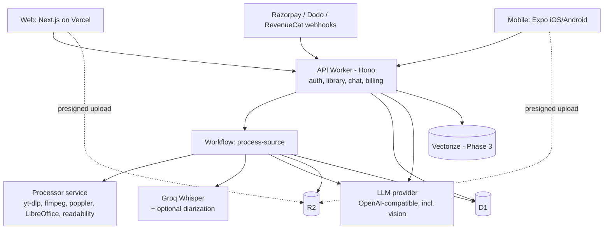

# anything2note.com — Full Build Plan

Upload **anything** — a YouTube link, a meeting recording, a lecture video, a podcast, a PDF, slides, a photo of a whiteboard, a web article, or pasted text — pick what kind of content it is, and get highly detailed notes plus the right extras for that type: minutes of meeting and action items for meetings; notes, flashcards, and quizzes for lectures; and so on. Every item also gets an AI assistant you can chat with about it. Available on web, iOS, and Android.

---

## 1. Decisions

| Area | Choice | Notes |
|---|---|---|
| Web frontend | Next.js (App Router) on Vercel | Tailwind + shadcn/ui |
| Mobile | Expo (React Native) | Expo Router, EAS Build/Submit/Update |
| Backend API | Cloudflare Workers + Hono | `api.anything2note.com` |
| Pipeline orchestration | Cloudflare Workflows (+ Queues) | Durable steps with per-step retries |
| Database | Cloudflare D1 (SQLite) | Drizzle ORM (`drizzle-orm/d1`); large extracted content stored in R2 |
| File storage | Cloudflare R2 | Uploads, recordings, audio chunks, extracted content, exports |
| Vector search | Cloudflare Vectorize | Phase 3, for chat across many items; D1 FTS5 for keyword search |
| Processor service | Node 22 + Hono wrapping yt-dlp, ffmpeg, poppler, LibreOffice | Portable Docker image: Cloudflare Containers **or** Fly.io/Railway |
| LLM | Any OpenAI-compatible provider (e.g. OpenRouter) | Model configurable per task (notes, light, chat, vision, fallback) |
| Transcription | Groq Whisper (OpenAI-compatible) | Captions first for YouTube; Whisper for everything else |
| Speaker labels (diarization) | Optional pluggable provider (e.g. AssemblyAI or Deepgram) | Used for meetings/interviews when configured |
| Auth | Better Auth on Workers + D1 | Web cookies + Expo plugin |
| Web payments | Razorpay (India) + Dodo Payments (rest of world) | Routed by billing country at checkout; see §8 |
| Mobile payments | RevenueCat (App Store + Play Store IAP) | Required by store rules for digital subscriptions |
| Email | Resend (prod), console logging (local) | OTP codes, "notes ready", minutes sharing |
| Monitoring | Sentry, PostHog, Workers Logs | |
| Monorepo | pnpm workspaces + Turborepo | Shared TypeScript everywhere |

---

## 2. Product scope (full version)

### 2.1 Sources (what users can give us)

| Source | Formats | How content is extracted |
|---|---|---|
| YouTube link | Any public video | Captions first (manual → auto); else audio download → Whisper |
| Audio upload | mp3, m4a, wav, ogg, opus, flac, aac, webm | ffmpeg normalise → chunk → Whisper (+ diarization for meetings/interviews) |
| Video upload | mp4, mov, mkv, webm, avi | ffmpeg extracts audio → same as audio |
| In-app recording | Web (MediaRecorder) and mobile (expo-audio, background-capable) | Same as audio |
| PDF | Text PDFs and scanned PDFs | Text layer via poppler; pages with little/no text rendered to images → vision model OCR |
| Office documents | docx, pptx, odt, odp, rtf | LibreOffice headless → PDF → same as PDF (keeps page/slide numbers) |
| Images | jpg, png, webp, heic (whiteboards, handwritten notes, slide photos) | Vision model OCR + description |
| Plain text | txt, md, pasted text | Used directly |
| Web page / article | Public URL | Fetch + readability extraction (paywalled/login pages won't work) |

Every source is normalised into one internal format so all generators work the same way:

```ts
type ExtractedContent = {
  kind: 'timed' | 'paged' | 'plain'           // media | documents/images | text
  language: string
  segments: Array<{
    anchor: { type: 'time'; start: number; end: number } | { type: 'page'; page: number } | { type: 'none' }
    speaker?: string                            // 'S1', 'S2' … when diarization is available
    text: string
  }>
  sections: Array<{ title: string; anchorStart: Anchor; anchorEnd: Anchor }>
}
```

### 2.2 Note types (what users choose) and their outputs

Users pick a note type when adding a source, or choose **Auto-detect** (a cheap model classifies the first part of the content and suggests a type; the user can change it). Each type is a **preset** of output types; users can add or remove any output before or after generation ("also make flashcards for this meeting").

| Note type | Default outputs | Optional outputs |
|---|---|---|
| **Lecture / class** | Detailed notes, revision bullet points, flashcards, quiz, glossary | Key formulas, practice exam questions, mind map outline |
| **Meeting** | Minutes of meeting (MoM), TL;DR summary, action items, decisions, detailed notes | Open questions / risks, follow-up email draft, agenda for next meeting |
| **Interview** | Summary, Q&A breakdown, key insights, highlights (speaker + timestamp) | Follow-up questions, evaluation scorecard (hiring), detailed notes |
| **Podcast / talk / webinar** | Summary, key takeaways, chapters, detailed notes | Highlights, action ideas, flashcards |
| **Tutorial / how-to** | Step-by-step guide, prerequisites, commands/code snippets, summary | Troubleshooting tips, checklist, quiz |
| **Reading (paper, article, book chapter, document)** | Summary, detailed notes, key concepts, flashcards, quiz | Glossary, critique / limitations, citations list |
| **General** | Summary, detailed notes, key points | Any output above |

**Minutes of meeting** structure: title, date, duration, attendees (from speaker labels / mentions; user-editable), agenda items, discussion per agenda item, decisions made, action items (task, owner, due date if mentioned, anchor), open questions, next steps / next meeting.

**All note types also get:**
- AI chat about the item (streaming, cites timestamps or page numbers).
- Custom instructions ("focus on the pricing discussion", "write for a first-year student").
- Output language choice (notes in a different language from the source).
- Anchors on everything: timestamps for media (click to seek the player) and page/slide numbers for documents (click to jump in the viewer).
- Regenerate any single output; edit outputs manually.

### 2.3 Per-user features

- Library of items with folders/workspaces, search, filters by note type and source.
- Spaced-repetition flashcard reviews (FSRS) across all items that have flashcards.
- Quiz attempts, scores, weak topics.
- **Action items tracker** across all meetings (mark done, edit owner/due date, filter by meeting).
- Speaker renaming for meetings/interviews ("S1 → Priya").
- Exports: PDF, Markdown, DOCX (MoM), Anki CSV (and `.apkg` in Phase 3); copy as email; share read-only link.
- Daily review reminders (push on mobile, email on web); "notes ready" notifications.
- Retention settings: auto-delete original recordings/files after processing (default on for meetings).

---

## 3. Architecture



### Key principles

1. **Public vs private sources.** Public YouTube videos are **shared**: processed once and reused by every user who adds the same video (same note type + output + language), at zero extra cost. Everything else (uploads, recordings, URLs, pasted text) is **private** to its owner and is never reused across users — meetings and documents are confidential. Private items are deduplicated only within the same user (by content hash).
2. **Captions first** for YouTube; Whisper only when needed.
3. **One extraction format, many generators.** Every source becomes `ExtractedContent`; every output type is a generator that reads it. Note types are just presets of output types, so adding a new note type is configuration, not new pipeline code.
4. **Provider-agnostic AI.** All LLM, vision, transcription, diarization, and embedding calls go through small clients configured by base URL, key, and model.
5. **Shared content vs user state.** Sources and generations may be shared (public YouTube only); libraries, reviews, quiz attempts, action item status, speaker names, and chats are per user.
6. **Processor never holds R2 credentials.** The Worker streams files from R2 to the processor and streams results back into R2.

---

## 4. Monorepo layout

```
anything2note/
  apps/
    api/          Hono Worker: routes, Workflows, queue consumers, cron, webhooks
    web/          Next.js app
    mobile/       Expo app
    processor/    Node + Hono service wrapping yt-dlp, ffmpeg, poppler, LibreOffice
  packages/
    config/       env validation helper (defineConfig) + schema fragments
    shared/       zod schemas for API I/O, domain types, note types/outputs registry, plan limits
    api-client/   typed client used by web + mobile
    ai/           OpenAI-compatible clients, generators (one per output type), prompts, mock fixtures
    ui-tokens/    colours/spacing/typography shared by web + mobile
  docker/         Dockerfiles for local dev
  docker-compose.yml
  plan.md
  CLAUDE.md
```

---

## 5. Backend (Cloudflare)

### 5.1 API Worker routes (Hono)

| Method | Route | Purpose |
|---|---|---|
| * | `/auth/*` | Better Auth handler |
| GET | `/note-types` | Registry of note types and output types (clients render pickers from this) |
| POST | `/uploads` | Start an upload: returns presigned R2 URL(s) (multipart for large files) |
| POST | `/uploads/:id/complete` | Finish multipart upload, verify size/type |
| POST | `/sources` | Create an item: `{ source: youtube \| upload \| url \| text, noteType \| 'auto', outputs?, language?, instructions? }` → starts Workflow (or reuses shared result) |
| GET | `/sources/:id` | Status, metadata, note type, available outputs |
| PATCH | `/sources/:id` | Change title, folder, note type (triggers generation of missing outputs) |
| DELETE | `/sources/:id` | Remove from library (and delete private data) |
| GET | `/sources/:id/content` | Extracted transcript/text with anchors |
| GET | `/sources/:id/outputs` | All generated outputs for this item |
| POST | `/sources/:id/outputs` | Generate an extra output type |
| POST | `/generations/:id/regenerate` | Regenerate one output (optionally with new instructions) |
| PATCH | `/generations/:id` | Save manual edits (stored as a per-user override) |
| PATCH | `/sources/:id/speakers` | Rename speakers |
| GET | `/sources/:id/media` | Short-lived signed URL for the user's own uploaded media/document viewer |
| POST | `/sources/:id/chat` | Streaming chat (SSE) |
| GET | `/sources/:id/chat` | Chat history |
| GET | `/library` | Items, folders, filters |
| GET/PATCH | `/action-items` | List/update action items across meetings |
| GET | `/reviews/due` | Flashcards due today (FSRS) |
| POST | `/reviews` | Submit card rating |
| POST | `/quiz/:generationId/attempts` | Submit quiz answers |
| GET | `/stats` | Streaks, weak topics, usage |
| POST | `/exports` | Create PDF/Markdown/DOCX/Anki export |
| POST | `/shares` | Create a read-only share link |
| POST | `/billing/checkout` | Create Razorpay or Dodo checkout |
| POST | `/webhooks/razorpay`, `/webhooks/dodo`, `/webhooks/revenuecat` | Subscription events |
| GET | `/me` | Profile, plan, usage |

Middleware: CORS, auth session, rate limiting, zod validation, Sentry.

### 5.2 Processing pipeline (Cloudflare Workflow: `process-source`)

1. **Validate & check limits** — file type/size, duration (media) or page count (documents) against plan limits.
2. **Extract** (branch by source):
   - YouTube → captions via processor; else processor downloads audio → chunks → R2.
   - Audio/video/recording → Worker streams file from R2 to processor → normalised, chunked audio → R2.
   - PDF/Office → processor extracts per-page text; low-text pages rendered to PNG → vision model OCR.
   - Image → vision model OCR/description.
   - URL → processor fetches + readability; Text → used directly.
3. **Transcribe** (media only) — Groq Whisper per chunk with segment timestamps; if note type is meeting/interview and a diarization provider is configured, use it for speaker labels.
4. **Normalise** — build `ExtractedContent`, clean text, merge fragments, split into sections; store in R2 (`content/{sourceId}.json`).
5. **Classify** (only if note type = auto) — light model suggests the note type; user can change it later.
6. **Generate primary output** first (notes for lectures, minutes for meetings, summary for others) so the user sees something quickly.
7. **Generate remaining outputs** in parallel, respecting dependencies (e.g. flashcards and quiz read the detailed notes).
8. **Validate** every output with zod; repair-retry on failure; fallback model on provider errors.
9. **Save + notify** — write generations, action items, flashcards, quiz questions; mark `ready`; push/email.
10. **Cleanup** — delete audio chunks; delete original uploads if the user's retention setting says so.

Status values: `queued → extracting → transcribing → generating → ready | failed` (partial success allowed: an output can fail and be retried without failing the item).

### 5.3 Processor service (`apps/processor`)

- Node 22 + Hono, shelling out to `yt-dlp`, `ffmpeg`, `pdftotext`/`pdftoppm` (poppler), and LibreOffice headless; `@mozilla/readability` + `linkedom` for web pages.
- Endpoints:
  - `GET /health`
  - `POST /youtube/metadata`, `POST /youtube/captions`
  - `POST /media` (body: file stream from the Worker, or `{ youtubeId }`) → normalises, compresses (mono, low bitrate), chunks; returns manifest `{ jobId, durationSeconds, chunks: [{ index, durationSeconds, bytes }] }`
  - `GET /media/:jobId/:index` → streams a chunk with `Content-Length`
  - `POST /document` (body: file stream + filename) → `{ jobId, pages: [{ page, text, needsOcr }] }`
  - `GET /document/:jobId/pages/:page.png` → rendered page image for OCR
  - `POST /url` → `{ title, text, byline?, siteName? }`
  - `DELETE /jobs/:jobId` → cleanup (also automatic after `FILE_TTL_MINUTES`)
- Auth: shared secret header (`FETCHER_MODE=http`) or Cloudflare Containers binding (`FETCHER_MODE=container`).
- yt-dlp updated weekly in the image; supports cookies file and proxy via env.
- Deploy: start on Cloudflare Containers; move to Fly.io/Railway if YouTube blocks heavily. Same image.

### 5.4 AI layer (`packages/ai`)

**Registry (`packages/shared/note-types.ts`)** — note types and output types are data:

```ts
export const OUTPUT_TYPES = {
  detailed_notes:   { tier: 'notes', schema: DetailedNotes },
  revision_points:  { tier: 'light', schema: RevisionPoints, dependsOn: ['detailed_notes'] },
  flashcards:       { tier: 'light', schema: Flashcards,     dependsOn: ['detailed_notes'] },
  quiz:             { tier: 'light', schema: Quiz,           dependsOn: ['detailed_notes'] },
  glossary:         { tier: 'light', schema: Glossary },
  minutes:          { tier: 'notes', schema: MinutesOfMeeting },
  action_items:     { tier: 'light', schema: ActionItems },
  decisions:        { tier: 'light', schema: Decisions },
  follow_up_email:  { tier: 'light', schema: EmailDraft,     dependsOn: ['minutes'] },
  summary:          { tier: 'light', schema: Summary },
  chapters:         { tier: 'light', schema: Chapters },
  qa_breakdown:     { tier: 'notes', schema: QABreakdown },
  step_by_step:     { tier: 'notes', schema: StepGuide },
  // … every output listed in §2.2
} as const

export const NOTE_TYPES = {
  lecture: { label: 'Lecture / class', defaults: ['detailed_notes','revision_points','flashcards','quiz','glossary'], optional: [...] },
  meeting: { label: 'Meeting', defaults: ['minutes','summary','action_items','decisions','detailed_notes'], optional: [...] },
  // interview, podcast, tutorial, reading, general
} as const
```

Each output type has a generator in `packages/ai/generators/<type>.ts`: prompt builder (note-type-aware tone and structure), zod schema, model tier, and a mock fixture. The same generator adapts to the note type (e.g. `detailed_notes` for a meeting is organised by agenda item; for a lecture by concept).

**Config (per task, via env/secrets)**

```
LLM_BASE_URL=https://openrouter.ai/api/v1
LLM_API_KEY=...
MODEL_NOTES=...        # long-form: detailed notes, minutes, Q&A, guides
MODEL_LIGHT=...        # structured/short: cards, quiz, action items, summaries, classification
MODEL_CHAT=...         # tutor/assistant chat
MODEL_VISION=...       # OCR for images and scanned pages
MODEL_FALLBACK=...     # used if primary errors
STT_BASE_URL=https://api.groq.com/openai/v1
STT_API_KEY=...
STT_MODEL=whisper-large-v3-turbo
DIARIZATION_PROVIDER=none   # none | assemblyai | deepgram
DIARIZATION_API_KEY=...
EMBEDDING_MODEL=...    # Phase 3, for Vectorize (dimensions must match the index)
```

**Rules**
- All generation returns JSON validated by zod schemas in `packages/shared`.
- Every note section, flashcard, quiz question, action item, and decision carries an **anchor** (timestamp or page).
- Store `prompt_version` and `model` on each generation so old outputs can be regenerated when prompts improve.
- Long content uses map-reduce: per-section generation, then a merge/dedupe pass.
- Speaker names: use diarization labels; the LLM may *suggest* names from self-introductions, marked as suggestions until the user confirms.
- Custom instructions make a generation private to that user even for shared YouTube sources.

**Chat**
- Context = system prompt (note-type aware: tutor for lectures, meeting assistant for meetings) + extracted content with anchors + key outputs + recent messages.
- Most items fit in context; for very long documents, retrieve relevant sections first (keyword search in Phase 1–2, Vectorize in Phase 3).
- Prompt caching where the provider supports it; stream over SSE; save messages to D1.
- Phase 3: chat across a folder/workspace ("what did we decide about pricing across all Q3 meetings?") using Vectorize + FTS5.

---

## 6. Database (Cloudflare D1 + Drizzle)

### Setup

- Separate D1 databases per environment: `a2n-dev`, `a2n-staging`, `a2n-prod`.
- Drizzle ORM with `drizzle-orm/d1`; migrations via `drizzle-kit generate`, applied with `wrangler d1 migrations apply` in CI.
- **Keep D1 lean:** extracted content (transcripts/text with anchors) lives in **R2** as JSON; D1 stores metadata, generations, and all per-user state.
- D1 has no interactive transactions: use `db.batch([...])`, unique indexes for invariants, idempotent handlers.
- Read replication later if far-away users see slow reads.

### Schema

Better Auth creates `user`, `session`, `account`, `verification`. IDs are text (UUIDv7); timestamps are Unix ms; JSON stored as text.

```sql
-- Sources: one row per ingested thing
CREATE TABLE sources (
  id TEXT PRIMARY KEY,
  kind TEXT NOT NULL CHECK (kind IN ('youtube','audio','video','recording','pdf','office','image','text','url')),
  visibility TEXT NOT NULL CHECK (visibility IN ('shared','private')),  -- shared only for public YouTube
  owner_user_id TEXT REFERENCES user(id) ON DELETE CASCADE,            -- NULL for shared
  source_ref TEXT,                          -- YouTube ID, original R2 key, or URL
  content_hash TEXT,                        -- sha256 of uploaded bytes / normalised text
  title TEXT,
  meta_json TEXT,                           -- duration, pages, channel, mime, size, thumbnail
  language TEXT,
  extraction_method TEXT,                   -- manual_captions | auto_captions | whisper | pdf_text | ocr | readability | plain
  has_speakers INTEGER DEFAULT 0,
  content_r2_key TEXT,                      -- content/{id}.json (ExtractedContent)
  sections_json TEXT,
  status TEXT NOT NULL DEFAULT 'queued',    -- queued | extracting | transcribing | generating | ready | failed
  error TEXT,
  created_at INTEGER NOT NULL, updated_at INTEGER NOT NULL
);
CREATE UNIQUE INDEX shared_youtube_once ON sources (source_ref) WHERE visibility = 'shared';
CREATE UNIQUE INDEX private_dedupe ON sources (owner_user_id, content_hash) WHERE visibility = 'private' AND content_hash IS NOT NULL;

-- Generated outputs (one per source × note type × output type × language × instructions)
CREATE TABLE generations (
  id TEXT PRIMARY KEY,
  source_id TEXT NOT NULL REFERENCES sources(id) ON DELETE CASCADE,
  note_type TEXT NOT NULL,                  -- lecture | meeting | interview | podcast | tutorial | reading | general
  output_type TEXT NOT NULL,                -- detailed_notes | minutes | flashcards | quiz | action_items | ...
  language TEXT NOT NULL DEFAULT 'en',
  instructions_hash TEXT NOT NULL DEFAULT '',
  owner_user_id TEXT REFERENCES user(id) ON DELETE CASCADE,  -- set when private (private source or custom instructions)
  status TEXT NOT NULL DEFAULT 'queued',    -- queued | running | ready | failed
  content_json TEXT,
  model TEXT, prompt_version TEXT, error TEXT,
  created_at INTEGER NOT NULL, updated_at INTEGER NOT NULL,
  UNIQUE (source_id, note_type, output_type, language, instructions_hash, owner_user_id)
);

-- User edits to a generation (never mutate shared generations)
CREATE TABLE generation_overrides (
  user_id TEXT NOT NULL REFERENCES user(id) ON DELETE CASCADE,
  generation_id TEXT NOT NULL REFERENCES generations(id) ON DELETE CASCADE,
  content_json TEXT NOT NULL, updated_at INTEGER NOT NULL,
  PRIMARY KEY (user_id, generation_id)
);

CREATE TABLE flashcards (
  id TEXT PRIMARY KEY,
  generation_id TEXT NOT NULL REFERENCES generations(id) ON DELETE CASCADE,
  front TEXT NOT NULL, back TEXT NOT NULL,
  anchor_json TEXT, section_index INTEGER
);
CREATE INDEX flashcards_gen_idx ON flashcards (generation_id);

CREATE TABLE quiz_questions (
  id TEXT PRIMARY KEY,
  generation_id TEXT NOT NULL REFERENCES generations(id) ON DELETE CASCADE,
  prompt TEXT NOT NULL, options_json TEXT NOT NULL,
  correct_index INTEGER NOT NULL, explanation TEXT,
  difficulty TEXT, anchor_json TEXT, section_index INTEGER
);
CREATE INDEX quiz_gen_idx ON quiz_questions (generation_id);

-- Action items (meetings) are per user, because users tick them off and edit them
CREATE TABLE action_items (
  id TEXT PRIMARY KEY,
  user_id TEXT NOT NULL REFERENCES user(id) ON DELETE CASCADE,
  source_id TEXT NOT NULL REFERENCES sources(id) ON DELETE CASCADE,
  generation_id TEXT REFERENCES generations(id) ON DELETE SET NULL,
  task TEXT NOT NULL, owner_name TEXT, due_date TEXT,
  status TEXT NOT NULL DEFAULT 'open' CHECK (status IN ('open','done')),
  anchor_json TEXT,
  created_at INTEGER NOT NULL, updated_at INTEGER NOT NULL
);
CREATE INDEX action_items_user_idx ON action_items (user_id, status);

CREATE TABLE speakers (
  source_id TEXT NOT NULL REFERENCES sources(id) ON DELETE CASCADE,
  speaker_key TEXT NOT NULL,                -- S1, S2, ...
  display_name TEXT, suggested_name TEXT,
  PRIMARY KEY (source_id, speaker_key)
);

-- Library
CREATE TABLE folders (
  id TEXT PRIMARY KEY,
  user_id TEXT NOT NULL REFERENCES user(id) ON DELETE CASCADE,
  name TEXT NOT NULL
);

CREATE TABLE user_sources (
  user_id TEXT NOT NULL REFERENCES user(id) ON DELETE CASCADE,
  source_id TEXT NOT NULL REFERENCES sources(id),
  note_type TEXT NOT NULL,
  selected_outputs_json TEXT NOT NULL,      -- output types the user wants for this item
  language TEXT NOT NULL DEFAULT 'en',
  instructions TEXT,
  folder_id TEXT REFERENCES folders(id) ON DELETE SET NULL,
  title_override TEXT,
  added_at INTEGER NOT NULL, last_opened_at INTEGER,
  PRIMARY KEY (user_id, source_id)
);

CREATE VIRTUAL TABLE library_fts USING fts5(user_id UNINDEXED, source_id UNINDEXED, title, body);

-- Study state
CREATE TABLE card_reviews (
  user_id TEXT NOT NULL REFERENCES user(id) ON DELETE CASCADE,
  card_id TEXT NOT NULL REFERENCES flashcards(id) ON DELETE CASCADE,
  due INTEGER NOT NULL, stability REAL, difficulty REAL,
  reps INTEGER DEFAULT 0, lapses INTEGER DEFAULT 0, state INTEGER, last_review INTEGER,
  PRIMARY KEY (user_id, card_id)
);
CREATE INDEX card_reviews_due_idx ON card_reviews (user_id, due);

CREATE TABLE quiz_attempts (
  id TEXT PRIMARY KEY,
  user_id TEXT NOT NULL REFERENCES user(id) ON DELETE CASCADE,
  generation_id TEXT NOT NULL REFERENCES generations(id),
  answers_json TEXT NOT NULL, score INTEGER, created_at INTEGER NOT NULL
);

CREATE TABLE chat_messages (
  id TEXT PRIMARY KEY,
  user_id TEXT NOT NULL REFERENCES user(id) ON DELETE CASCADE,
  source_id TEXT NOT NULL REFERENCES sources(id) ON DELETE CASCADE,
  role TEXT NOT NULL, content TEXT NOT NULL,
  created_at INTEGER NOT NULL
);
CREATE INDEX chat_user_source_idx ON chat_messages (user_id, source_id, created_at);

CREATE TABLE shares (
  id TEXT PRIMARY KEY,                      -- slug
  user_id TEXT NOT NULL REFERENCES user(id) ON DELETE CASCADE,
  source_id TEXT NOT NULL REFERENCES sources(id) ON DELETE CASCADE,
  output_types_json TEXT NOT NULL,
  expires_at INTEGER, created_at INTEGER NOT NULL
);

CREATE TABLE usage (
  user_id TEXT NOT NULL REFERENCES user(id) ON DELETE CASCADE,
  period TEXT NOT NULL,                     -- '2026-09'
  media_minutes INTEGER DEFAULT 0, document_pages INTEGER DEFAULT 0,
  chat_messages INTEGER DEFAULT 0,
  PRIMARY KEY (user_id, period)
);

-- Billing (single source of truth across Razorpay, Dodo, RevenueCat)
CREATE TABLE subscriptions (
  id TEXT PRIMARY KEY,
  user_id TEXT NOT NULL REFERENCES user(id),
  provider TEXT NOT NULL CHECK (provider IN ('razorpay','dodo','revenuecat')),
  provider_sub_id TEXT NOT NULL,
  plan TEXT NOT NULL,
  status TEXT NOT NULL,                     -- active | pending_renewal | past_due | cancelled | expired
  current_period_end INTEGER,
  updated_at INTEGER NOT NULL,
  UNIQUE (provider, provider_sub_id)
);
CREATE UNIQUE INDEX one_live_sub_per_user ON subscriptions (user_id)
  WHERE status IN ('active','pending_renewal','past_due');
```

User settings (retention, default language, default note type, `billing_provider`) are added to `user` via Better Auth `additionalFields`.

Vectorize (Phase 3): index `content-chunks` with metadata `{ source_id, owner_user_id, anchor }`; always filter by the requesting user's accessible sources so private content never leaks.

---

## 7. Authentication (Better Auth)

- Runs inside the API Worker, stored in D1 (Drizzle adapter).
- Sign-in methods: Google, email OTP/magic link, and **Sign in with Apple** (Apple generally requires it on iOS when you offer other third-party logins).
- Web: session cookie scoped to `.anything2note.com` so `anything2note.com` (Vercel) and `api.anything2note.com` (Worker) share it.
- Mobile: Better Auth Expo integration, tokens kept in `expo-secure-store`.
- Protect sign-up with Cloudflare Turnstile to stop bots burning free quota.

---

## 8. Payments

### Plans (starting point — tune after launch)

| | Free | Pro |
|---|---|---|
| Media minutes / month (audio, video, YouTube, recordings) | small (e.g. 120) | large (e.g. 2,000) |
| Document pages / month (PDF, Office, images) | small (e.g. 50) | large (e.g. 2,000) |
| Max media length | 60 min | 5 hours |
| Max upload size | 200 MB | 2 GB |
| Note types | all | all |
| Speaker labels (meetings/interviews) | ✗ | ✓ |
| Chat messages | limited per day | generous |
| Exports (PDF / DOCX / Anki) & share links | Markdown only | ✓ |
| Spaced repetition, action items | ✓ | ✓ |

Price in INR for India and USD elsewhere (purchasing-power pricing).

### Providers (decided)

| Channel | Provider | Why |
|---|---|---|
| Web, India | **Razorpay** Subscriptions | Lowest cost for INR, no fixed fee, UPI AutoPay + cards + netbanking |
| Web, rest of world | **Dodo Payments** (merchant of record) | Handles global VAT/sales tax, invoicing, chargebacks; RBI/FEMA-friendly payouts to India |
| iOS / Android | **RevenueCat** (App Store + Play Billing) | Required IAP for digital subscriptions; one SDK for both stores |

### Routing rules

- The checkout provider is decided by the **billing country the user confirms at checkout**, not by IP alone. Pre-select using Cloudflare `request.cf.country`, but show a "Billing country: India / Other" switch.
- India → Razorpay, INR prices. Everyone else → Dodo, USD prices (Dodo can present local currency).
- Store the chosen provider on the user (`billing_provider`). A user keeps that provider for as long as their subscription is active; switching only happens after cancellation/expiry, never mid-period.
- Block a second active web subscription if one already exists on any provider (including RevenueCat), and show "You're already Pro via App Store/Play Store/web".
- Edge cases to handle:
  - Indian student abroad with an Indian card → they choose India → Razorpay (their card works).
  - VPN users → the billing-country switch overrides IP.
  - A Razorpay card/UPI mandate fails → retry, then fall back to offering Dodo checkout (international cards) if they have no working Indian method.

### Webhook → entitlement flow

```
Razorpay webhook ─┐
Dodo webhook ─────┼─► /webhooks/{provider} ─► verify signature ─► idempotency check (event id)
RevenueCat hook ──┘                                         ─► upsert subscriptions row
                                                            ─► recompute user entitlement (isPro, period_end)
```

- Every provider maps to the same internal statuses: `active | pending_renewal | past_due | cancelled | expired`.
- `pending_renewal` exists for Indian recurring mandates (UPI AutoPay / e-mandates have a pre-debit notice and delayed debit). Keep the user Pro during a grace period (e.g. 3 days past `current_period_end`) so slow debits don't lock them out.
- Store raw webhook payloads in a `billing_events` table for debugging and reconciliation.
- Use the Better Auth user ID as RevenueCat's app user ID and as `notes`/`metadata` customer reference on Razorpay and Dodo, so every event maps back to one user.
- A nightly Cron Trigger reconciles: fetch active subscriptions from each provider API and fix any drift from missed webhooks.

### Extra table

```sql
CREATE TABLE billing_events (
  id TEXT PRIMARY KEY,               -- provider event id (idempotency key)
  provider TEXT NOT NULL,
  user_id TEXT,
  type TEXT NOT NULL,
  payload_json TEXT NOT NULL,
  received_at INTEGER NOT NULL
);
-- plus: billing_provider TEXT on "user", added via Better Auth additionalFields
```

### Pricing guidance

- India: push **yearly** plans (e.g. ₹999–1,499/year) alongside monthly; UPI AutoPay mandates above ₹15,000 need extra authentication, so keep plans below that.
- Rest of world: USD monthly + yearly; consider purchasing-power discounts for lower-income regions later.
- Mobile: same plans in App Store / Play Console; enrol in Apple's and Google's small-business programs for the lower commission; price mobile slightly higher than web to absorb store fees if desired.

### Compliance and accounting (India side)

- Razorpay sales are your own domestic sales: register for **GST**, charge GST on Indian subscriptions, issue GST invoices (Razorpay can generate invoices; or use an invoicing tool), file returns. Get a CA involved early.
- Dodo sales arrive as export-of-services remittances; keep Dodo payout reports for your books (FIRA/FIRC documentation as required).
- App store revenue arrives as payouts from Apple/Google; they handle consumer tax in most regions.
- Refund policy, terms of service, and privacy policy pages are required by Razorpay, Dodo, and both app stores before going live.
- Check each store's current rules on linking to web checkout from inside the app before adding any such link.

### Implementation order

1. Provider-agnostic billing module in the API Worker (`billing/` with one adapter per provider, common status mapping).
2. Dodo first (covers everyone while you set up GST), then Razorpay for India.
3. RevenueCat when the mobile app ships (Phase 3).
4. Nightly reconciliation job + admin view of subscriptions and billing events.

---

## 9. Web app (Next.js + Tailwind + shadcn/ui)

**Pages**
- `/` landing page; `/pricing`; SEO pages per use case (`/meeting-minutes`, `/lecture-notes`, `/pdf-to-notes`, `/youtube-to-notes`, `/podcast-summary`…) with sample outputs.
- `/app` library: grid/list of items, folders, search, filter by note type and source.
- `/app/new` add flow:
  1. **Source picker** — YouTube link, upload any file (drag & drop, multiple files), record audio in the browser, paste text, web URL.
  2. **Note type picker** — Lecture, Meeting, Interview, Podcast/talk, Tutorial, Reading, General, or Auto-detect (pre-selected from the source: e.g. a PDF suggests Reading, a recording suggests Meeting).
  3. **Outputs checklist** — defaults from the note type, toggle extras; language; optional custom instructions.
  4. Live progress (extracting → transcribing → generating), with the first output shown as soon as it's ready.
- `/app/i/[id]` item workspace: source viewer on one side (YouTube embed, audio/video player, PDF/page viewer, image, or text) and output tabs on the other. **Tabs are driven by the note type**:
  - Meeting → Minutes · Action items · Decisions · Notes · Follow-up email · Transcript · Chat
  - Lecture → Notes · Revision · Flashcards · Quiz · Glossary · Transcript · Chat
  - Others → per the registry
  - Clicking any anchor seeks the player or jumps to the page. "+ Add output" menu generates extras; each output has regenerate, edit, copy, export.
- `/app/actions` all action items across meetings (open/done, owner, due date, meeting).
- `/app/review` today's due flashcards across all items.
- `/app/stats` streaks, weak topics, usage (minutes and pages).
- `/app/settings` account, plan & billing, default note type, output language, retention (auto-delete originals).
- `/s/[slug]` read-only shared outputs.

**Tech**
- TanStack Query + shared `api-client`; uploads straight to R2 with presigned (multipart) URLs and progress bars.
- Streaming chat via SSE.
- Markdown + KaTeX rendering (maths in lectures), PDF viewer with page anchors (pdf.js).
- Browser recording via MediaRecorder with a visible consent reminder for meetings.

---

## 10. Mobile app (Expo)

- **Expo Router** tabs: Library · Add · Review · Actions · Profile.
- **Add**: record (with background recording via `expo-audio`, pause/resume, consent reminder), pick files (`expo-document-picker`), camera/photo for whiteboards (`expo-image-picker`), paste a link. Uploads continue in the background and resume on failure.
- **Share sheet intake**: share a YouTube link, file, PDF, or image from any app into anything2note.
- Item screen mirrors web: source player/viewer + note-type-driven tabs, anchor seeking (`react-native-youtube-iframe`, `expo-video`/audio player, PDF viewer).
- **Offline**: cache outputs and due flashcards (`expo-sqlite`); sync reviews and action-item ticks when online.
- **Push** (`expo-notifications`): "your notes are ready", "cards due today", "action items due".
- **NativeWind** styling, same `api-client` and zod types as web.
- **Payments**: `react-native-purchases` (RevenueCat).
- Builds via **EAS Build / Submit**; OTA via **EAS Update**.

---

## 11. Study and productivity engine

- **Spaced repetition** (FSRS via `ts-fsrs`) for any item with flashcards; shared by Worker and mobile offline mode.
- **Quizzes** with attempts, scores, and weak-topic tracking per section.
- **Action items**: extracted per meeting, copied into the user's `action_items` table, editable and tickable; overdue reminders. Phase 3: push to Todoist/Asana/Linear/Google Tasks.
- **Minutes distribution**: copy as email, export DOCX/PDF, share link. Phase 3: email minutes to attendees directly.
- **Exports**: PDF and DOCX rendered in the processor; Markdown in the Worker; Anki CSV (Phase 3: `.apkg` built in the processor).

---

## 12. Security, abuse, and limits

- Rate limit per user and per IP on `/sources`, `/uploads`, `/chat`, auth routes.
- Enforce plan limits *before* starting a Workflow (duration/page count from metadata).
- Only accept valid YouTube URLs; reject live streams and extremely long videos.
- Uploads: size/type allow-list, presigned R2 URLs, verify file type by magic bytes server-side, never execute or render untrusted files outside the processor sandbox.
- URL sources: block private/internal IP ranges and non-http(s) schemes (SSRF protection) in the processor.
- **Private content isolation**: every query for sources, generations, chats, and vectors is scoped to the requesting user; shared generations exist only for public YouTube sources without custom instructions. Add tests that prove user A can never read user B's private items.
- Meeting recordings: consent reminder before recording; retention setting to auto-delete originals after processing; R2 objects are encrypted at rest.
- Never expose provider API keys to clients; all AI calls go through the Worker.
- Prompt-injection hygiene: extracted content (transcripts, documents, web pages) is treated as data inside prompts, never as instructions.
- Deletion: users can delete their account, items, chats, and uploads; deleting a private item removes its R2 objects, generations, and vectors (GDPR/DPDP compliance).

---

## 13. Observability

- **Sentry** in web, mobile, Worker, and processor.
- **PostHog** for funnels (visit → sign up → first item → first output viewed → second item → paid), broken down by source kind and note type.
- **Workers Logs** + a `jobs` view in an internal admin page (failed items/outputs, retry button, cost per item).
- Track per-item AI cost (tokens × model price, Whisper and diarization minutes, OCR pages) to keep margins visible.

---

## 14. Cost drivers

1. LLM tokens for generation — per item for private sources (the majority), shared for public YouTube.
2. Transcription minutes (Groq Whisper) for every audio/video/recording and caption-less YouTube video.
3. Diarization minutes (if a provider is enabled) — Pro only.
4. Vision/OCR tokens for scanned PDFs and images.
5. LLM tokens for chat — cap on free plan, use prompt caching.
6. Processor compute (Containers / Fly.io) — LibreOffice and ffmpeg are the heavy parts.
7. R2 storage for uploads (reduced by auto-delete retention) and D1/Vectorize usage (small).
8. Cloudflare Workers Paid plan, payment fees, app store commissions, developer program fees.

Because most content is now private and processed per user, **price by minutes and pages**, and keep the free plan tight.

---

## 15. Risks and mitigations

| Risk | Mitigation |
|---|---|
| Private data leaking between users | Strict per-user scoping, shared cache only for public YouTube, isolation tests in CI, Vectorize filters by owner |
| Meeting recording consent / privacy laws | Consent reminder before recording, clear privacy policy, retention controls, delete-on-request |
| YouTube blocks datacenter IPs / ToS | Captions-first; cookies + proxy support; uploads as the main path; no media download features for users |
| Poor speaker attribution in meetings | Optional diarization provider; user-editable speaker names; LLM name suggestions marked as unconfirmed |
| Bad extraction (scanned PDFs, messy slides, handwriting) | OCR fallback with vision model, per-page `needsOcr` detection, "report issue" + regenerate |
| Large uploads | Multipart presigned uploads, resumable mobile uploads, size limits per plan |
| App Store / Play Store rejection | Position as a notes/productivity tool, Sign in with Apple, IAP, recording permission strings, privacy labels |
| AI cost blowouts | Minutes/pages limits, light model for structured outputs, prompt caching, per-item cost tracking |
| Hallucinated minutes/action items | Anchors on every item so users can verify, editable outputs, "not mentioned" instead of guessing owners/dates |
| Provider outages | OpenAI-compatible abstraction + fallback models |
| Domain / name availability | Confirm `anything2note.com` and app store names before branding work |

---

## 16. Roadmap

### Phase 0 — Foundations (week 1–2)
- Monorepo, CI, environments, domains; D1 databases, Drizzle migrations; Better Auth (email OTP + Google); Sentry.
- `packages/config` env validation; `packages/shared` contracts and note-type/output registry.
- Processor service with `/health`, YouTube captions, media normalisation, PDF text; Docker Compose for local dev; AI mock mode.

### Phase 1 — Core web product (week 3–7)
- Sources: YouTube, audio/video upload, PDF, pasted text.
- Note types: **Lecture, Meeting, General** with their default outputs.
- Workflow `process-source`, private vs shared caching, item workspace with anchors, chat.
- Library, folders, search, basic usage limits, landing page.
- **Launch to a small group (students + a few teams) and collect feedback.**

### Phase 2 — Everything on web (week 8–12)
- Sources: Office docs, images (OCR), web URLs, browser recording.
- Note types: Interview, Podcast/talk, Tutorial, Reading, Auto-detect; all optional outputs.
- Diarization + speaker renaming; action items tracker; FSRS reviews, quizzes, weak topics.
- Razorpay + Dodo subscriptions and plan enforcement; exports (PDF, DOCX, Markdown, Anki CSV); share links; retention settings.
- PostHog funnels, admin page.

### Phase 3 — Mobile + advanced (week 13–18)
- Expo app with recorder (background), share-sheet intake for any file/link, offline cards, push, RevenueCat, Sign in with Apple, store submissions.
- Vectorize chat across folders/workspaces; integrations (calendar recordings, Todoist/Asana/Linear for action items, email minutes to attendees); `.apkg` export; custom note templates (Pro); team workspaces.

---

## 17. Open decisions

- [x] Name: **anything2note** — confirm `anything2note.com`, social handles, and app store name availability.
- [x] Payments: **Razorpay (India) + Dodo (rest of world) + RevenueCat (mobile)**.
- [ ] Ask Dodo for their exact fees; ask Razorpay about UPI AutoPay subscription pricing for your volume.
- [ ] GST registration and CA before launching Indian payments.
- [ ] Diarization provider for meetings (AssemblyAI vs Deepgram vs none at launch).
- [ ] Processor host: Cloudflare Containers first, or Fly.io/Railway from day one (LibreOffice makes the image large — check Containers image size limits).
- [ ] Specific models for notes, light, chat, vision, and fallback (benchmark on real lectures, meetings, and scanned PDFs).
- [ ] Exact plan limits (minutes, pages) and INR/USD prices.
- [ ] Default retention for meeting recordings (recommend auto-delete originals after processing).
- [ ] Embedding model for Vectorize (fixes the index dimensions).